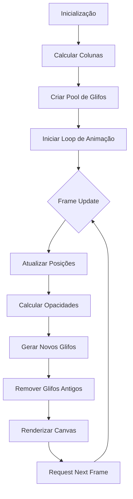

# Plano de Implementação: Efeito Matrix em Compose

## 1. Análise do Contexto Atual

### Estado Atual
- Projeto Android com Jetpack Compose
- Tema MATRIX já implementado com efeitos básicos
- `MatrixBackdrop()` desenha scanlines e chuva de caracteres simples
- 18 colunas fixas com caracteres ASCII (33-122)
- Animação linear com transições infinitas
- Performance básica usando Canvas nativo

### Limitações Identificadas
1. Densidade fixa de colunas (18)
2. Caracteres limitados a faixa ASCII básica
3. Velocidades e fases pré-computadas com seed fixa
4. Sem variação de brilho/opacidade dinâmica
5. Sem efeitos de destaque (caracteres "brilhantes")
6. Sem rastros de desvanecimento sofisticados
7. Sem adaptação dinâmica ao redimensionamento
8. Sem elementos interativos

## 2. Arquitetura Técnica

### Abordagem: Canvas Customizado com Sistema de Partículas

```
┌─────────────────────────────────────────────┐
│            MatrixEffect Composable           │
├─────────────────────────────────────────────┤
│  • Canvas principal com drawScope           │
│  • Sistema de gerenciamento de colunas      │
│  • Pool de partículas (glifos)              │
│  • Sistema de animação baseado em tempo     │
│  • Gerenciador de recursos (fontes, cores)  │
└─────────────────────────────────────────────┘
```

### Componentes Principais

1. **MatrixEffect Composable**
   - Componente raiz que ocupa fundo
   - Responsável por layout e redimensionamento
   - Gerencia ciclo de vida das animações

2. **ColumnManager**
   - Gerencia colunas dinâmicas baseadas na largura
   - Calcula posições X e larguras
   - Distribui densidade conforme resolução

3. **GlyphParticleSystem**
   - Pool de objetos Glyph reutilizáveis
   - Cada glifo tem: posição, velocidade, cor, opacidade, caractere
   - Sistema de reciclagem para performance

4. **AnimationController**
   - Controla tempo global da animação
   - Gerencia múltiplas transições simultâneas
   - Otimiza atualizações com LaunchedEffect

5. **VisualEffectsRenderer**
   - Renderiza efeitos especiais (destaques, rastros, brilhos)
   - Aplica shaders/filtros quando disponíveis
   - Gerencia layers de composição

## 3. Características Visuais dos Glifos

### Paleta de Cores Matrix
```
Cor Primária:      #00FF7A (verde Matrix brilhante)
Cor Secundária:    #00C853 (verde mais escuro)
Cor de Destaque:   #B9FFD9 (verde claro suave)
Cor de Fundo:      #001000 a #001A0A (gradiente escuro)
```

### Tipografia
- **Fonte Principal**: Monospace (Typeface.MONOSPACE)
- **Caracteres**: Conjunto estendido incluindo:
  - Caracteres ASCII 33-126
  - Caracteres Katakana (para autenticidade Matrix)
  - Símbolos especiais (▄, ▀, █, ■, ▓, ▒, ░)
  - Números binários (0, 1) para variação

### Propriedades dos Glifos
1. **Tamanho**: 14-22sp (variável por coluna)
2. **Opacidade**: 0.1 a 0.9 (com desvanecimento)
3. **Brilho**: Multiplicador de luminosidade (1.0-3.0)
4. **Velocidade**: 0.5-3.0 unidades/segundo
5. **Aceleração**: Leve aceleração no início
6. **Rotação**: Pequena variação angular (±5°)

### Efeitos de Rastro
```
┌─────────────┬───────────────────────────────┐
│ Tipo        │ Características               │
├─────────────┼───────────────────────────────┤
│ Desvanecimento │ Opacidade decresce linear  │
│             │ Comprimento: 8-15 caracteres  │
├─────────────┼───────────────────────────────┤
│ Brilho      │ Pico de luminosidade no head  │
│             │ Dissipação exponencial        │
├─────────────┼───────────────────────────────┤
│ Distorção   │ Leve deslocamento horizontal  │
│             │ Efeito "glitch" ocasional     │
└─────────────┴───────────────────────────────┘
```

## 4. Sistema de Animação

### Estratégia de Fluxo Contínuo



### Otimizações de Performance

1. **Object Pooling**: Reutilização de objetos Glyph
2. **Density Culling**: Não renderizar glifos fora da tela
3. **Frame Skipping**: Adaptar FPS baseado em carga
4. **Memory Management**: Limitar número máximo de glifos
5. **Canvas Batching**: Agrupar operações de desenho

### Controles de Animação
- **FPS Alvo**: 30-60 FPS (adaptativo)
- **Número Máximo de Glifos**: 200-500 (baseado em densidade)
- **Taxa de Geração**: 2-10 glifos/segundo por coluna
- **Duração do Ciclo**: 2-4 segundos por coluna

## 5. Responsividade e Redimensionamento

### Adaptação Dinâmica

```kotlin
class ResponsiveMatrixConfig {
    // Densidade baseada em DPI e tamanho
    fun calculateColumns(screenWidth: Float, density: Float): Int {
        return max(12, (screenWidth / (density * 40)).toInt())
    }
    
    // Tamanho de fonte adaptativo
    fun calculateFontSize(density: Float): Float {
        return 14f * density
    }
}
```

### Comportamentos por Orientação
- **Retrato**: Mais colunas, glifos mais densos
- **Paisagem**: Menos colunas, glifos mais espaçados
- **Tablet**: Maior densidade, mais glifos simultâneos

### Tratamento de Configurações
1. **Mudança de Orientação**: Recalcular layout sem interromper animação
2. **Multi-tela**: Suporte a diferentes aspect ratios
3. **Modo Picture-in-Picture**: Reduzir intensidade
4. **Bateria Baixa**: Reduzir FPS e número de glifos

## 6. Elementos Interativos Opcionais

### Controles do Usuário
1. **Intensidade**: Slider para densidade da chuva
2. **Velocidade**: Controle de velocidade geral
3. **Cores**: Seletor de paleta (verde, ciano, branco)
4. **Efeitos**: Toggle para brilho/destaques/glitch

### Interações por Toque
- **Toque em glifo**: Destacar caractere temporariamente
- **Arrastar**: Criar "ondas" na chuva
- **Toque longo**: Congelar/retomar animação
- **Pinch**: Ajustar zoom/densidade

### Integração com Chat
- **Mensagens novas**: Pulsar destaque na coluna correspondente
- **Digitação**: Sincronizar com efeitos de "chuva"
- **Tema MATRIX**: Ativar/desativar com toggle no app bar

## 7. Plano de Implementação Passo a Passo

### Fase 1: Refatoração da Base Existente
1. Extrair `MatrixBackdrop` para classe separada
2. Criar sistema de configuração parametrizável
3. Implementar testes unitários para cálculos básicos

### Fase 2: Sistema de Partículas
1. Implementar classe `GlyphParticle`
2. Criar `GlyphParticlePool` com object pooling
3. Desenvolver `ParticleSystem` para gerenciamento

### Fase 3: Renderização Avançada
1. Melhorar `drawRain` com efeitos de rastro
2. Implementar destaque de caracteres aleatórios
3. Adicionar efeitos de glitch ocasionais

### Fase 4: Responsividade
1. Implementar `ResponsiveMatrixConfig`
2. Adicionar listeners para mudanças de configuração
3. Testar em múltiplas densidades e orientações

### Fase 5: Interatividade
1. Adicionar modificadores de toque
2. Implementar controles na UI
3. Criar preferências persistentes

### Fase 6: Otimização
1. Perfil de performance com Android Profiler
2. Ajustar limites baseados em dispositivo
3. Implementar fallbacks para hardware antigo

## 8. Considerações Técnicas

### Dependências
- Jetpack Compose 1.5+
- Android API 21+ (para ampla compatibilidade)
- Sem bibliotecas externas (para manter leveza)

### Testes
- Testes unitários para cálculos matemáticos
- Testes de instrumentação para renderização
- Testes de performance em dispositivos reais

### Manutenibilidade
- Documentação completa com KDoc
- Exemplos de uso em diferentes cenários
- Configuração via theme/system

### Acessibilidade
- Opção para reduzir movimento
- Contraste suficiente para leitura
- Suporte a modo daltonismo

## 9. Próximos Passos

1. **Aprovação deste plano** pelo usuário
2. **Switch para modo Code** para implementação
3. **Implementação iterativa** seguindo as fases
4. **Testes e refinamentos** contínuos
5. **Integração final** com o tema MATRIX existente

---

*Este plano fornece uma base técnica sólida para implementar um efeito Matrix visualmente autêntico e performático no aplicativo WillX Chat.*